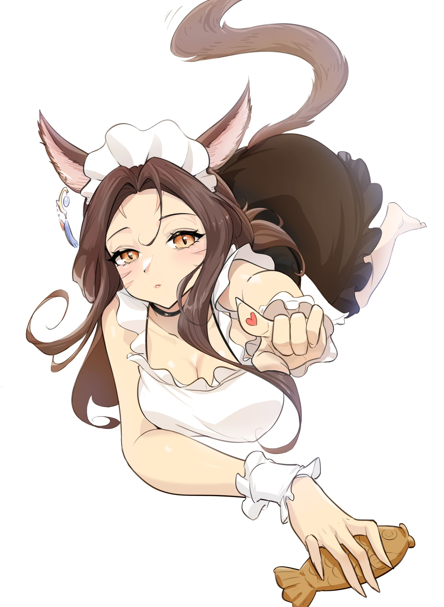

你好呀，我是 **再花** —— 一个想要变得有趣的灵魂 
住在成都的 Angular 前端攻城狮，一只编程咪娘 
喜欢打游戏、写博客、和**方方大人** 一起摸鱼 💕 
日常含妻量超标，狗粮拉满
介意的话……也来不及了！ 
<b>- 最近在做什么 -</b>  

 
    <b>花墨</b> — Angular 20 + NestJS 驱动的个人博客，写技术、写随笔、写方方 ✍️ 
    <b>工具箱</b> — 集合了我和朋友想要的实用小工具（收集灵感中……） 

 

### 🛠️ 技术栈

  
  
  
  
  
  
  
    
  
  
  
  
  
  

### 📊 GitHub 摸鱼记录

  
  

### 📬 找我玩

  
  &nbsp;
  

    <i>「希望我能一直这样写下去。」</i>  

<!--
  这个角落藏着一个前端小 B 的梦想
  如果你看到了这里，那说明我们有缘分！
  欢迎来花墨坐坐 → https://flowersink.com
-->
